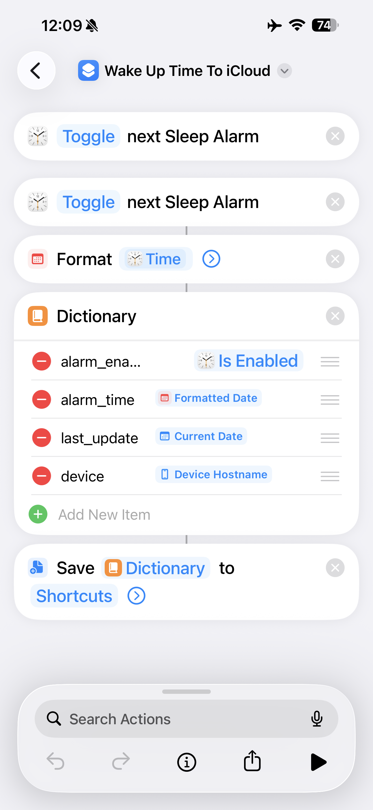

# RoboCurtain

Automatically open my SwitchBot curtain 10 minutes before my iPhone's "Wake Up" alarm, and closing at sunset, without the need for a hub.

Create iPhone automated shortcut that fetches "Wake Up" alarm (by toggling alarm twice) and save it to iCloud Files.


JSON file looks something like this:
```json
{
    "alarm_enabled": true,
    "alarm_time": "2026-04-19T08:30:00+02:00",
    "device": "Hugos-iPhone-3",
    "last_update": "2026-04-19T02:30:03+02:00"
}
```


Running the program.
```sh
uv run python src/main.py
```

Symlink the configuration.
```sh
ln -sf "$(pwd)/config/com.hugohulsebosch.robocurtain.plist" ~/Library/LaunchAgents/com.hugohulsebosch.robocurtain.plist
launchctl load ~/Library/LaunchAgents/com.hugohulsebosch.robocurtain.plist
```

Unload when unhappy.
```sh
launchctl unload ~/Library/LaunchAgents/com.hugohulsebosch.robocurtain.plist
```